# TEORIA BL1. El Camp d'entrenament

**CFGM SMX · 0225 Xarxes Locals**

## Índex

1. [Definició i tipus de xarxes](#1-definició-i-tipus-de-xarxes)
2. [Arquitectura i tecnologia existent](#2-arquitectura-i-tecnologia-existent)
3. [Elements d'una xarxa](#3-definició-característiques-i-funcionalitats-associades-als-elements-duna-xarxa)
4. [Mitjans de transmissió: cables i sense fils](#4-mitjans-de-transmissió-cables-i-sense-fils)
5. [Mapa físic i lògic d'una xarxa local](#5-definicions-de-mapa-físic-i-lògic-duna-xarxa-local)
6. [Estructures alternatives](#6-estructures-alternatives)
7. [Normativa legal i tècnica](#7-normativa-legal-i-tècnica-dimplantació-de-xarxes-locals)
8. [Documentació tècnica](#8-documentació-tècnica)

## Activitats

- [Sessió 3: Arquitectura i elements de la xarxa](BL1-Sessio3-Arquitectura-elements-xarxa.md)
- [Sessió 4: Arquitectura i elements de la xarxa](BL1-Sessio4-Arquitectura-elements-xarxa.md)
***

## 1. Definició i tipus de xarxes

### Què és una xarxa?

Una xarxa és un **sistema d'interconnexió** entre màquines (ordinadors o altres dispositius de xarxa) que permet compartir recursos i informació. Per fer-ho possible cal, a més dels ordinadors, targetes de xarxa, cables (o interfícies sense fils), dispositius perifèrics i el software adequat.

És a dir, una xarxa és una estructura formada per **mitjans físics** (dispositius reals) i **mitjans lògics** (programari de transmissió i control), desenvolupada per satisfer les necessitats de comunicació d'una determinada zona geogràfica.

L'objectiu és connectar diferents equips perquè intercanviïn informació. El senyal que rep el receptor és el que ha enviat l'emissor més un component d'error (soroll) que s'hi suma durant la transmissió. Per això calen mecanismes de detecció i correcció d'errors:

```
senyal rebuda = senyal enviada + soroll
```

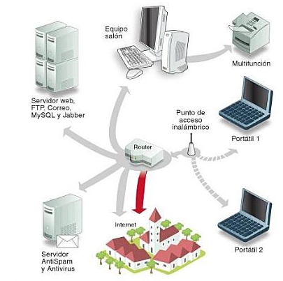

### Tipus de xarxes

**Segons l'accés a la xarxa**

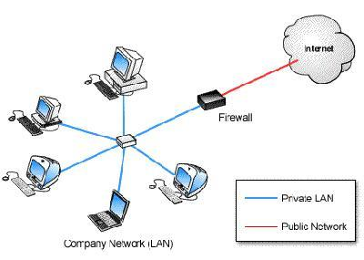

- **Xarxa d'accés públic**: la pot utilitzar qualsevol persona mitjançant l'adreça IP que li proporciona el seu proveïdor de serveis (ISP). Els equips que hi són connectats són visibles per qualsevol altre equip d'Internet.
- **Xarxa privada**: utilitza adreces IP privades (rangs reservats, p. ex. `10.0.0.0/8`, `172.16.0.0/12`, `192.168.0.0/16`). Els equips no accedeixen directament a Internet i necessiten un router que faci de traductor entre les adreces privades i les públiques (mitjançant **NAT**, *Network Address Translation*).

**Segons la tècnica de transferència de la informació**

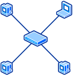

- **Xarxes commutades (punt a punt)**: un equip origen selecciona l'equip amb què vol connectar-se i la xarxa habilita una via de connexió. El dispositiu habitual és el commutador o *switch*.

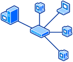

- **Xarxes client-servidor**: hi ha un o diversos servidors i diversos clients o terminals. El servidor centralitza processos i dades, cosa que millora l'eficiència i la seguretat en xarxes amb molts usuaris.
- **Xarxes broadcast**: un equip envia la informació a tots els equips de la xarxa; cada màquina comprova el camp d'adreça del paquet i el processa només si va dirigit a ella. Actualment, en Ethernet commutat, el broadcast es limita a trames concretes (ARP, DHCP, etc.) i no és el mètode general de transmissió com ho era amb els *hubs*.

**Segons la localització geogràfica**

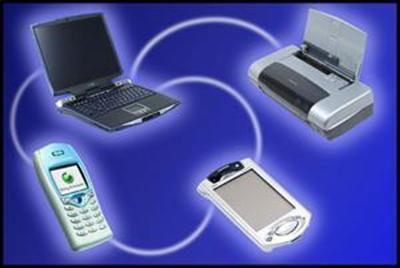

| Tipus | Abast | Característiques |
|---|---|---|
| **PAN** (*Personal Area Network*) | Uns pocs metres | Dispositius personals (mòbil, portàtil, auriculars, wearables). Actualment sol ser sense fils: Bluetooth, Bluetooth LE, NFC, Wi-Fi Direct. |
| **LAN** (*Local Area Network*) | Oficina, edifici, campus | Privada, pertany a una mateixa organització, baixa taxa d'error, alta velocitat (avui 1 Gbps–10 Gbps en cablejat, i fins a diversos Gbps en Wi-Fi modern). |
| **MAN** (*Metropolitan Area Network*) | Una ciutat | Pot utilitzar infraestructura pública o privada (fibra òptica municipal, xarxes d'operador). |
| **WAN** (*Wide Area Network*) | Diverses ciutats, països, continents | Es basa en línies de comunicació d'operadors de telecomunicacions; Internet n'és l'exemple més gran. Actualment moltes WAN corporatives utilitzen **SD-WAN**, que gestiona el trànsit de manera intel·ligent entre diverses connexions (fibra, 4G/5G, MPLS). |
| **WLAN** (*Wireless LAN*) | Xarxa d'àrea local sense cables | Ús general a llars i empreses. Estàndards actuals: **Wi-Fi 5 (802.11ac)**, **Wi-Fi 6 / 6E (802.11ax)** i **Wi-Fi 7 (802.11be)**, amb velocitats teòriques de diversos Gbps. |


> **Nota d'actualització:** les taxes d'error relatives entre WAN i LAN que es donaven fa anys (WAN uns 1.000 cops pitjor) han millorat molt gràcies a la fibra òptica i als protocols de correcció d'errors moderns, però el principi General es manté: els enllaços de llarga distància solen tenir més latència i, potencialment, més pèrdua de paquets que una LAN cablejada.

**Segons la topologia**

Classificació segons com s'interconnecten físicament o lògicament els nodes. Es tracta més endavant a l'apartat 5.

---

## 2. Arquitectura i tecnologia existent

### Serveis i protocols

Els serveis de comunicacions d'una xarxa segueixen **protocols**: normes que cal seguir per transmetre informació (velocitat, tipus de dades, format dels missatges, etc.), de la mateixa manera que en la comunicació humana (llenguatge, codis de circulació, protocol telefònic, etc.) calen regles compartides entre emissor i receptor.

Els serveis bàsics de comunicació inclouen: transmissió de veu, transmissió de dades, establiment de la comunicació i tarificació.

### Arquitectura d'una xarxa

L'arquitectura d'una xarxa ve definida per tres característiques fonamentals:

- **Topologia**: organització del cablejat/connexions, defineix la configuració física de la interconnexió de màquines.
- **Mètode d'accés al medi**: necessari quan el medi és compartit, per evitar que dues estacions transmetin alhora i es produeixi una col·lisió.
- **Protocols de comunicació**: regles i procediments per establir la comunicació, corregir errors, etc.

Les xarxes s'organitzen en **capes o nivells** per reduir la complexitat del disseny. Regles bàsiques:

- Cada nivell ofereix un conjunt de serveis, definits mitjançant protocols estàndard.
- Cada nivell es comunica només amb el nivell immediatament superior i inferior.
- Cada nivell dona serveis al nivell superior.

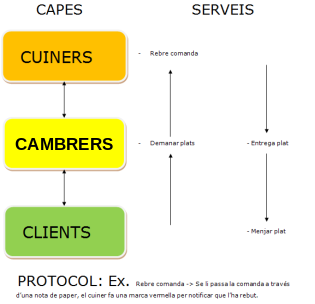

### Una mica d'història: per què vam acabar organitzant les xarxes en capes?

La idea de dividir una xarxa en capes no va sorgir d'un dia per l'altre ni d'una única persona: és el resultat d'uns quants anys (finals dels 60 fins a mitjans dels 80) intentant resoldre un problema molt concret: **fer que ordinadors de fabricants diferents es poguessin entendre entre si**.

- **Anys 60: xarxes "de propietari".** Quan van aparèixer les primeres xarxes d'ordinadors, cada fabricant creava la seva pròpia solució tancada: IBM tenia la seva, DEC la seva, etc. Cada equip parlava un "idioma" propi i només es podia connectar amb màquines del mateix fabricant. Si volies connectar un ordinador IBM amb un DEC, senzillament no funcionava.

- **1969: ARPANET.** La primera xarxa de commutació de paquets a gran escala, finançada pel Departament de Defensa dels EUA (DARPA), connecta els primers quatre nodes universitaris. Feia servir un protocol anomenat **NCP** (*Network Control Program*), encara molt lligat al maquinari concret de la xarxa.

- **1973–1974: apareix la idea clau de "capes independents".** L'enginyer francès **Louis Pouzin**, dissenyant la xarxa experimental **CYCLADES**, proposa un principi revolucionari: que la xarxa només s'encarregui de moure paquets ("datagrames") d'un lloc a l'altre, sense garantir-ne el lliurament, i que sigui una capa **superior**, als extrems de la comunicació, la que s'encarregui de la fiabilitat (aquest és l'anomenat *end-to-end principle*). Aquesta separació de responsabilitats és la llavor de tot el que avui coneixem com "capes de xarxa".
- Basant-se en aquesta idea, **Vint Cerf i Bob Kahn** publiquen el 1974 l'article *"A Protocol for Packet Network Intercommunication"*, on defineixen el que més tard es dividirà en **TCP** i **IP**: un disseny pensat, ja des del principi, per interconnectar xarxes diferents entre si (d'aquí ve la paraula *Internet*, "entre xarxes").
- El mateix 1974, **IBM** presenta la seva pròpia arquitectura en capes, **SNA** (*Systems Network Architecture*), demostrant que la idea de "dividir en nivells" ja començava a semblar la manera correcta de dissenyar qualsevol xarxa complexa, encara que cada fabricant ho seguís fent a la seva manera.

- **Per què capes, i no un disseny monolític?** Amb l'experiència d'aquests primers anys, la comunitat tècnica identifica els motius que avui expliquem amb l'exemple del restaurant:
  - Permet **canviar una tecnologia sense afectar les altres** (per exemple, passar de cable de coure a fibra òptica sense haver de redissenyar les aplicacions).
  - Facilita el **disseny, la implementació i la depuració** per equips diferents, treballant cadascun en el seu nivell.
  - Permet que **fabricants diferents** puguin construir components compatibles si respecten les mateixes "regles" a cada nivell.

- **1977–1984: la ISO intenta posar ordre.** Amb cada fabricant fent la seva pròpia arquitectura en capes (IBM amb SNA, DEC amb DECnet...), la **ISO** (*International Organization for Standardization*) engega el 1977 un grup de treball per crear un model de referència **comú i neutral**. L'enginyer **Charles Bachman** (Honeywell) presenta la primera proposta de model en capes aquell mateix any. Després de diverses revisions, el 1984 es publica oficialment l'estàndard **ISO 7498**, conegut com a **model OSI** (*Open Systems Interconnection*): 7 capes pensades per descriure **qualsevol** arquitectura de xarxa possible, independentment del fabricant.

- **1 de gener de 1983 — el "Flag Day".** Mentre la ISO encara treballava en el disseny teòric del model OSI, **ARPANET** fa el pas decisiu a la pràctica: en aquell dia, tots els ordinadors de la xarxa deixen d'utilitzar l'antic NCP i passen a fer servir **TCP/IP** de manera obligatòria i simultània. És el naixement operatiu d'Internet tal com la coneixem.

- **Per què "guanya" TCP/IP i no OSI?** Aquí hi ha la paradoxa històrica que encara expliquem avui: el model **OSI** és molt complet i rigorós, però va trigar anys a acabar-se de definir i els seus protocols reals (X.25, X.400...) eren complexos i lents d'implementar. **TCP/IP**, en canvi, ja **funcionava de manera real** des de 1983, era més senzill, i va créixer de la mà de l'expansió d'Internet durant els anys 80 i 90. Quan finalment van aparèixer implementacions comercials d'OSI, ja era massa tard: TCP/IP s'havia convertit en l'estàndard *de facto*. Per això avui:
  - Utilitzem **TCP/IP** com a arquitectura real de totes les xarxes i d'Internet.
  - Seguim ensenyant el **model OSI** perquè, com a model de referència purament conceptual, continua sent l'eina més clara i completa per explicar i comparar qualsevol arquitectura de xarxa (és exactament l'ús que se li dona en aquests apunts).

### Model de referència OSI

**OSI** (*Open Systems Interconnection*) és el nom del model de referència d'arquitectura en capes per a xarxes d'ordinadors, proposat per la **ISO**. Estructura els serveis en **7 capes**, de la més propera al medi físic (capa 1) a la més propera a les aplicacions (capa 7).

Quan un usuari transmet dades a un destí, el sistema de xarxa afegeix informació de control (capçalera) a cada capa.

> El model OSI va sorgir com un intent d'unificar coneixements i tècniques perquè servís de referència comuna als fabricants a l'hora de construir xarxes compatibles entre si. Avui dia és, sobretot, **un model didàctic i de referència**; el model que realment s'utilitza a la pràctica és **TCP/IP** (vegeu més avall).

| Capa | Nom | Funció principal |
|---|---|---|
| 7 | Aplicació | Interactua amb l'usuari final: HTTP/HTTPS, DNS, correu (SMTP/IMAP), FTP/SFTP, etc. |
| 6 | Presentació | Format, xifratge i compressió de les dades (TLS, JPEG, etc.). |
| 5 | Sessió | Estableix, manté i finalitza sessions entre aplicacions. |
| 4 | Transport | Comunicació extrem a extrem: TCP, UDP, QUIC. Ports. |
| 3 | Xarxa | Adreçament lògic (IP) i encaminament (routers). |
| 2 | Enllaç de dades | Trames, adreçament físic (MAC), control d'errors i de flux. |
| 1 | Física | Medi de transmissió, senyal, connectors. |

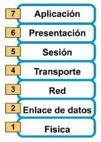

**1. Capa física** — medis de transmissió, cablejat i connectors, espectre electromagnètic, multiplexació, dispositius com targetes de xarxa i concentradors.

**2. Capa d'enllaç** — sincronització emissor/receptor, estructuració en trames, control d'errors i de flux.

**3. Capa de xarxa** — adreçament lògic (IP), mida dels paquets, mode datagrama o circuit virtual, encaminament (routers).

**4. Capa de transport** — comunicació extrem a extrem entre aplicacions, independent de les màquines intermèdies. Protocols principals: **TCP** (fiable, orientat a connexió) i **UDP** (no fiable, sense connexió). Es defineixen els **ports** per identificar les aplicacions. *(Cal afegir-hi també **QUIC**, el protocol de transport modern sobre UDP que fa servir HTTP/3.)*

**5. Capa de sessió** — estableix, manté i finalitza sessions d'usuari. Exemple: una consulta web anònima. Protocols com **TLS** (successor de SSL, ja obsolet i insegur) permeten sessions xifrades i autenticades.

**6. Capa de presentació** — format de les dades, xifratge, compressió.

**7. Capa d'aplicació** — transferència de fitxers, correu electrònic, navegació web, accés a bases de dades.

### Encapsulació de les dades

Cada nivell gestiona una **unitat de dades de protocol (PDU)** pròpia:

| Capa | Unitat de dades (PDU) |
|---|---|
| Aplicació / Presentació / Sessió | Dades (*Data*) |
| Transport | Segment (TCP) / Datagrama (UDP) |
| Xarxa | Paquet |
| Enllaç | Trama |
| Física | Bits |

**Encapsulació**: procés pel qual les dades inicials es divideixen i se'ls afegeixen capçaleres a cada capa per ser transmeses. **Desencapsulació**: el procés invers, al receptor.

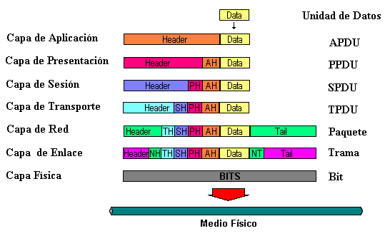

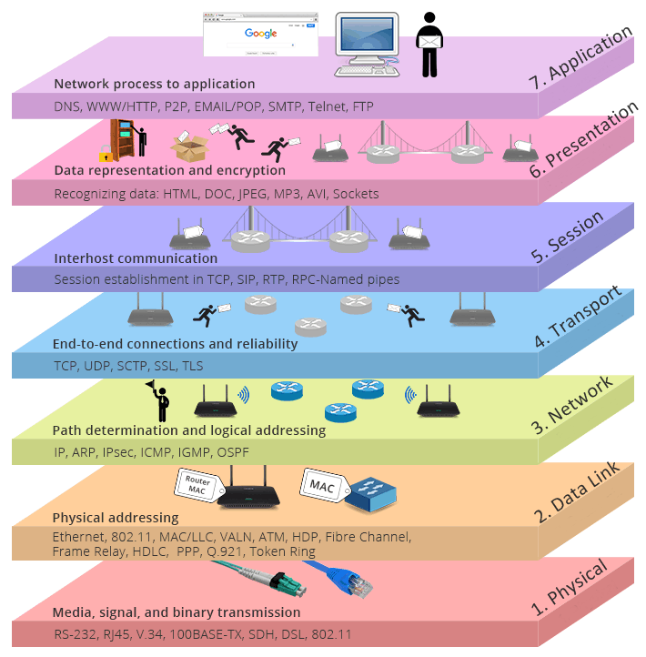

### Arquitectura TCP/IP

**TCP/IP** és el model d'arquitectura de xarxa que **realment s'utilitza avui dia**, tant en xarxes petites com a Internet global. És fiable i relativament senzill per a l'encaminament de paquets. El nom prové dels seus dos protocols més importants: **TCP** (*Transmission Control Protocol*, capa de transport) i **IP** (*Internet Protocol*, capa de xarxa).

TCP/IP no és un únic protocol, sinó una arquitectura completa organitzada en capes, amb dos objectius fonamentals:

- Permetre connectar xarxes diferents (de diferents fabricants o cablejats).
- Ser tolerant a fallades.

| TCP/IP | Model OSI equivalent |
|---|---|
| Aplicació | Aplicació + Presentació + Sessió |
| Transport | Transport |
| Internet | Xarxa |
| Accés a la xarxa (NAL) | Enllaç de dades + Física |

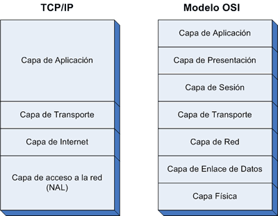

Encapsulació en TCP/IP:

| Capa | PDU |
|---|---|
| Aplicació | Dades |
| Transport (TCP/UDP) | Segments / Datagrames UDP |
| Internet (IP) | Datagrames / Paquets |
| Accés a la xarxa | Trama (Ethernet, Wi-Fi...) |

Protocols habituals per capa en la pila TCP/IP:

- **Aplicació**: HTTP/HTTPS, DNS, SMTP/IMAP/POP3, SSH, FTP/SFTP.
- **Transport**: TCP, UDP, QUIC.
- **Internet**: IP (IPv4 i, cada cop més, **IPv6**), ARP, ICMP, IGMP.
- **Accés a la xarxa**: Ethernet, Wi-Fi (802.11), *Token Ring* i *ATM* (aquests dos, avui pràcticament en desús).

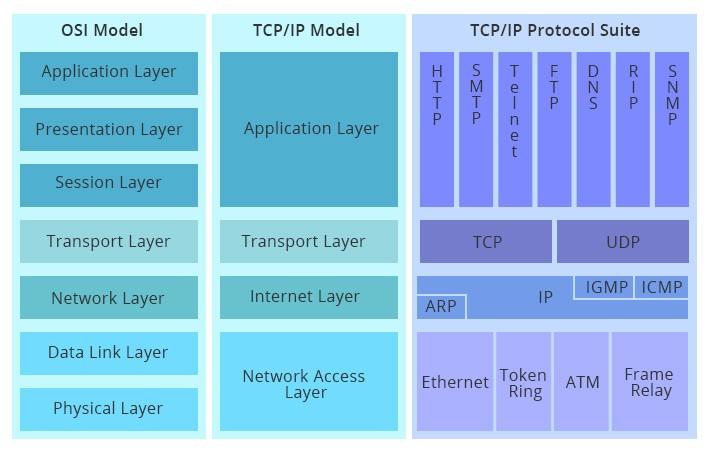

> **Nota d'actualització important:** l'esgotament de les adreces **IPv4** ha fet que la implantació d'**IPv6** hagi avançat molt, especialment en xarxes mòbils i proveïdors d'Internet. En qualsevol formació actual de xarxes cal tenir present que IPv6 conviu amb IPv4 (doble pila, *dual-stack*) en la majoria d'infraestructures.

---

## 3. Definició, característiques i funcionalitats associades als elements d'una xarxa

### Targeta de xarxa o NIC (capa 1/2)

També anomenada *Network Interface Card* (NIC), és el dispositiu que permet a un ordinador connectar-se a una xarxa: per cable (Ethernet) o sense fils (Wi-Fi). Pot estar integrada a la placa base, en una ranura d'expansió o ser externa (USB).

A l'hora d'escollir una targeta, cal fixar-se en:

- La velocitat que suporta: **Fast Ethernet (100 Mbps)**, **Gigabit Ethernet (1 Gbps)**, **2.5G/5G/10G Ethernet** (cada cop més habituals en equips moderns).
- El tipus de connexió: **RJ-45** (parell trenat) per a cable, o antena/xip per a Wi-Fi. El cable coaxial (connector BNC) és **tecnologia obsoleta**, pràcticament fora d'ús.
- El tipus de connector intern: **PCIe** i **M.2** en equips actuals; **USB** per a adaptadors externs. Connectors antics com ISA, PCI o PCMCIA ja no s'utilitzen en maquinari modern.


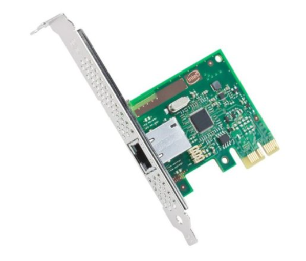

### Repetidor (capa 1)

Dispositiu electrònic que connecta dos segments d'una mateixa xarxa, regenerant el senyal per compensar-ne l'atenuació en distàncies llargues (per exemple, més de 100 m en cable de coure). Opera al nivell físic: és molt ràpid, però no processa les dades.

> En xarxes actuals, la funció de "repetidor" ha estat absorbida en bona part pels **repetidors Wi-Fi / sistemes mesh** (*mesh Wi-Fi*), que amplien la cobertura sense fils de manera més intel·ligent que un simple repetidor de senyal.

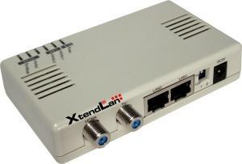

### Hub o concentrador (capa 1) — **tecnologia obsoleta**

Dispositiu que interconnectava ordinadors reenviant cada paquet rebut a **tots** els ports, deixant que cada equip decidís si el paquet era per a ell. Era poc eficient i no aïllava col·lisions.

> **Actualització important:** els *hubs* estan pràcticament **en desús total** avui dia. Han estat substituïts íntegrament pels **switchs**, molt més eficients, econòmics i disponibles a qualsevol pressupost. Es manté aquí per motius històrics i de comprensió del funcionament dels switchs.

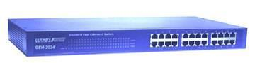

### Servidor d'impressió o *print server* (capa 1)

Dispositiu que permet connectar una impressora a la xarxa mitjançant cable o Wi-Fi, assignant-li una adreça IP pròpia. Avui en dia, la majoria d'impressores incorporen aquesta funcionalitat de fàbrica (targeta de xarxa i/o Wi-Fi integrats), fent innecessari un dispositiu extern en la majoria de casos.

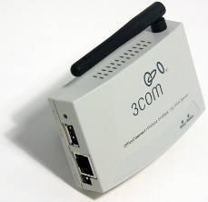
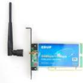

### Bridge o pont (capa 2)

Dispositiu capaç de dividir la xarxa en dos segments, de manera que el trànsit d'un segment no col·lisiona amb el de l'altre. Té capacitat de control: accepta o filtra trames segons el seu contingut (adreça MAC). Avui dia aquesta funció s'ha integrat pràcticament del tot dins els switchs.

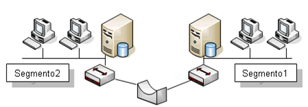

### Switch o commutador (capa 2)

Dispositiu que interconnecta ordinadors per formar una xarxa LAN. Construeix una **taula d'adreces MAC** per port, i envia cada trama **només** pel port on es troba el destinatari (a diferència del *hub*).

Característiques:

- Sempre és un dispositiu local.
- Multiport (més de 2 ports).
- Molt més ràpid que un pont tradicional.
- Reparteix l'ample de banda de forma eficient.
- Molts models comercials són apilables i escalables.

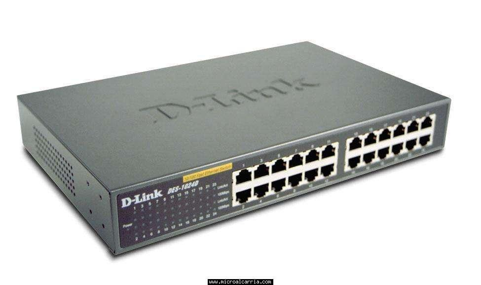

**Funcionament:** el commutador construeix una taula per cada port amb les adreces MAC dels dispositius que hi veu, i només envia cada trama pel port on es troba el destinatari.

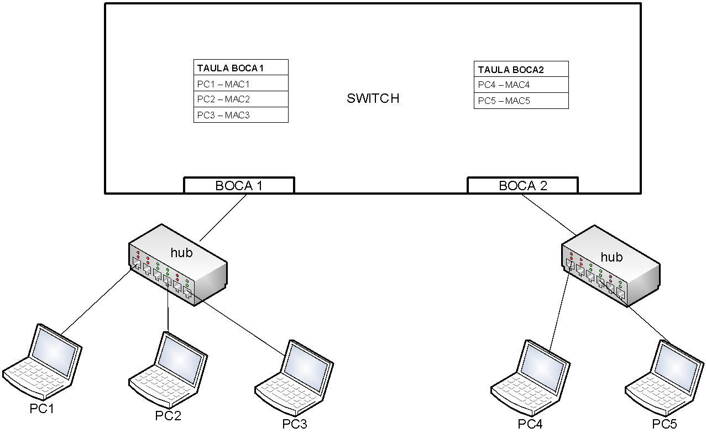

Els **switchs gestionables** (capa 2 o capa 3) utilitzen protocols de gestió (SNMP, RMON) i permeten crear **VLANs**, balancejar càrrega, aplicar QoS i, en el cas dels de capa 3, encaminar trànsit entre xarxes. Actualment és habitual que fins i tot switchs d'ús domèstic/SOHO ofereixin gestió bàsica via web.

### Punt d'accés o *access point* (capa 2)

Dispositiu que recull el senyal sense fils dels dispositius Wi-Fi i el transforma en senyal de cable per enviar-lo al switch (o viceversa). Els punts d'accés actuals solen suportar estàndards **Wi-Fi 5/6/6E/7**, múltiples bandes (2.4 GHz, 5 GHz i 6 GHz) i, en entorns empresarials, es gestionen de manera centralitzada mitjançant un **controlador Wi-Fi** o des del núvol.

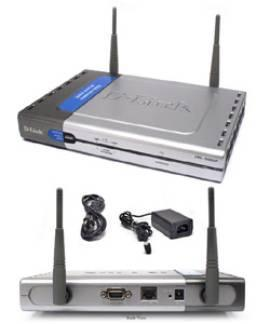

### Mòdem (capa 1/2) — **ús molt reduït**

Dispositiu que convertia senyals digitals en analògiques (i viceversa) per transmetre dades per la línia telefònica ("modular"/"demodular"). Els mòdems ADSL ja treballaven directament sobre línies digitals.

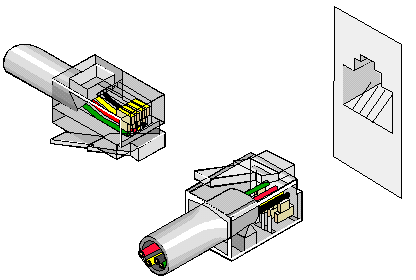
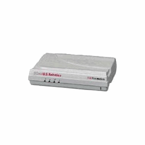

> **Actualització important:** l'ADSL i els mòdems tradicionals estan **en clara decadència**, substituïts majoritàriament per **fibra òptica fins a la llar (FTTH)** i, en zones rurals o com a alternativa, per **connexions 4G/5G**. El terme "mòdem" es manté d'ús comú per referir-se al dispositiu ONT/router que dona accés a Internet, encara que tècnicament ja no faci una modulació/demodulació analògica.

### Router (capa 3)

El router o encaminador és un dispositiu (maquinari o programari) que encamina paquets entre xarxes diferents, calculant el millor camí (segons la seva **taula de rutes**) perquè arribin de l'origen al destí.

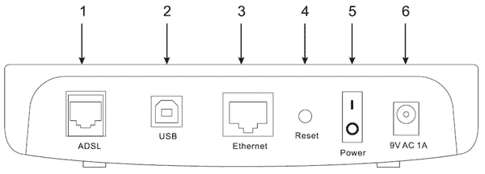

Característiques:

- Té una adreça MAC per interfície.
- Treballa amb adreces IP; substitueix la MAC de destí (la seva pròpia) per la de l'ordinador destí final.
- Selecciona la ruta segons la seva taula de rutes.
- Separa els **dominis de broadcast**.

Tipus:

- **Router d'interior**: instal·lat dins d'una LAN, encamina entre segments interns.
- **Router d'exterior**: comunica nodes i xarxes fora d'una LAN; s'utilitza al nucli d'Internet entre operadors.
- **Router de frontera** (*Gateway router*): connecta routers interiors amb exteriors (per exemple, la LAN d'una empresa amb Internet a través de l'ISP).

> **Actualització:** els routers domèstics i SOHO actuals integren habitualment en un sol equip les funcions de router, switch, punt d'accés Wi-Fi i, sovint, ONT de fibra òptica. En entorns empresarials, moltes d'aquestes funcions (encaminament, tallafocs, filtratge) es desenvolupen mitjançant **routers/firewalls de nova generació (NGFW)** i tecnologies definides per programari (**SD-WAN**, **SDN**).

---

## 4. Mitjans de transmissió: cables i sense fils

El medi de transmissió és el material a través del qual viatgen els paquets de dades.

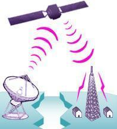

### Medis guiats (cablejats)

- **Cable telefònic**: originàriament per a veu, avui en desús per a dades.
- **Cable coaxial**: cable de coure blindat contra interferències. **Pràcticament fora d'ús** en xarxes locals modernes; es manté en alguns entorns de televisió per cable/HFC.
- **Cable UTP** (*Unshielded Twisted Pair*): 4 parells de coure trenats. És el més utilitzat avui en LAN. Categories habituals: **Cat 5e** (1 Gbps), **Cat 6** (1–10 Gbps, distàncies curtes) i **Cat 6A/7/8** (10 Gbps o més, per a *data centers*).
- **Cable STP** (*Shielded Twisted Pair*): similar a l'UTP però amb blindatge addicional, útil en entorns amb més interferències electromagnètiques.
- **Fibra òptica**: fibres de vidre o plàstic molt primes que transporten llum. Avui és l'estàndard per a **backbones**, connexions entre edificis i, cada cop més, per a la connexió a Internet dels usuaris finals (**FTTH**). Ofereix el màxim ample de banda i la mínima atenuació a llarga distància.

### Medis no guiats (sense fils)

Comunicació sense cables mitjançant ones electromagnètiques. Segons freqüència i longitud d'ona: raigs gamma, raigs X, llum ultraviolada, llum visible, infrarojos, microones i ones de ràdio (les que s'utilitzen en xarxes Wi-Fi, Bluetooth, xarxes mòbils, etc.).

Estàndards sense fils habituals actualment:

- **Wi-Fi**: 802.11ac (Wi-Fi 5), 802.11ax (Wi-Fi 6/6E), 802.11be (Wi-Fi 7).
- **Bluetooth / Bluetooth LE**: comunicacions de curt abast, PAN.
- **Xarxes mòbils**: 4G/LTE i **5G**, cada vegada més utilitzades també com a alternativa d'accés a Internet fix.

### Paràmetres de caracterització

- **Velocitat de transmissió**: temps per enviar un paquet, en bits per segon.
- **Ample de banda**: quantitat de dades transmeses per unitat de temps (bps, Kbps, Mbps, Gbps, Tbps), utilitzant múltiples de 1.000 (a diferència de la memòria, que sol usar múltiples de 1.024).

```
1 bps
1 Kbps  = 1.000 bps
1 Mbps  = 1.000.000 bps
1 Gbps  = 1.000.000.000 bps
1 Tbps  = 1.000.000.000.000 bps
```

- **Distorsió/soroll**: afecta la qualitat de la transmissió (climatologia en sense fils, interferències electromagnètiques en cablejat).
- **Espai entre repetidors**: distància màxima abans de necessitar regenerar el senyal.
- **Fiabilitat**: taxa d'error acceptable.
- **Cost**: el cable de coure és més barat; la fibra òptica té millor rendiment però un cost d'instal·lació més alt (encara que en els darrers anys s'ha abaratit molt).
- **Facilitat d'instal·lació**.

### Sentit de la comunicació

- **Símplex**: unidireccional (p. ex., televisió tradicional).
- **Half-duplex**: bidireccional, però no simultani (p. ex., walkie-talkie).
- **Full-duplex**: bidireccional i simultani (p. ex., trucada telefònica, Ethernet modern).

### Mode de transmissió

- **Sèrie**: un bit rere l'altre.
- **Paral·lel**: múltiples bits simultàniament (avui gairebé exclusiu de buses interns, no de xarxes).

### Sincronització

- **Síncrona**: rellotges sincronitzats, transmissió a ritme constant.
- **Asíncrona**: sincronització per cada unitat de transmissió (paraula), sense un rellotge compartit continu.

### Exemple de càlcul: temps de descàrrega

```
BW = ample de banda (bps)
P  = rendiment real (bps)
T  = temps de transferència (s)
S  = mida de l'arxiu (bits)

Millor cas:  T = S / BW
Cas típic:   T = S / P
```

**Exemple:** descarregar un arxiu de 20 MB en una xarxa **Gigabit Ethernet (1 Gbps)**:

```
S  = 20 MB × 1024 × 1024 × 8 = 167.772.160 bits
BW = 1 Gbps = 1.000.000.000 bps

T = S / BW = 167.772.160 / 1.000.000.000 ≈ 0,168 s
```

> *(Nota: l'exemple original de l'apunt feia servir "Fast Ethernet (200 Mbps)", però Fast Ethernet correspon en realitat a 100 Mbps. S'ha corregit l'exemple utilitzant Gigabit Ethernet (1.000 Mbps) com a referència més realista i actual.)*

---

## 5. Definicions de mapa físic i lògic d'una xarxa local

Els plànols i gràfics que representen una xarxa s'han de documentar amb aplicacions informàtiques adequades.

Aplicacions habituals:

- **Microsoft Visio** (programari propietari, integrat a Microsoft 365).
- **Draw.io / diagrams.net** (gratuïta, en línia i d'escriptori — molt utilitzada actualment com a alternativa lliure).
- **Lucidchart** (en línia, amb versió educativa).
- **Dia** (programari lliure, integra models de disseny de Cisco) — manteniment discontinu, ús cada cop més limitat.
- **Cisco Packet Tracer** i **GNS3**: simuladors de xarxa amb capacitat de generar diagrames i simular-ne el funcionament, molt utilitzats en formació.

### Mapa físic

Representa la disposició real dels elements: ubicació dels equips, canaletes, armaris de comunicacions, patch panels, switchs, etc., normalment sobre un plànol de l'edifici.

**Exemples de diagrames de mapes físics de xarxa:**

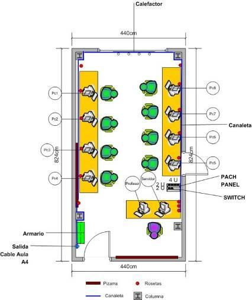

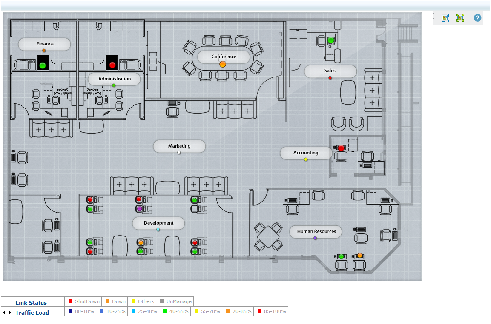

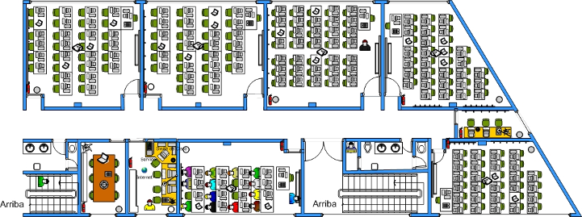

### Mapa lògic

Representa l'estructura lògica de la xarxa: adreces IP, adreces MAC, noms dels dispositius i les seves relacions, independentment de la seva ubicació física.

**Exemple de diagrama de mapa lògic de xarxa:**

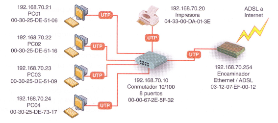

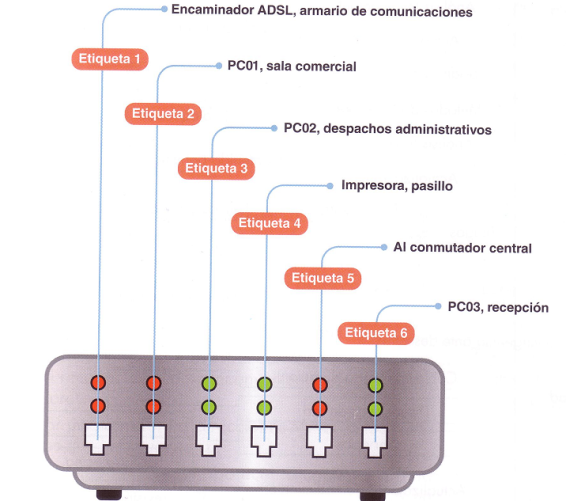

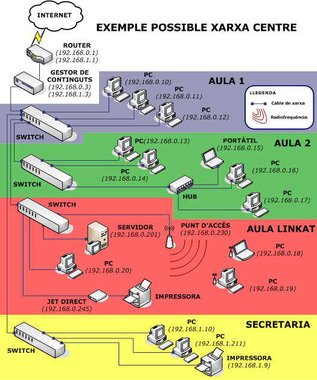

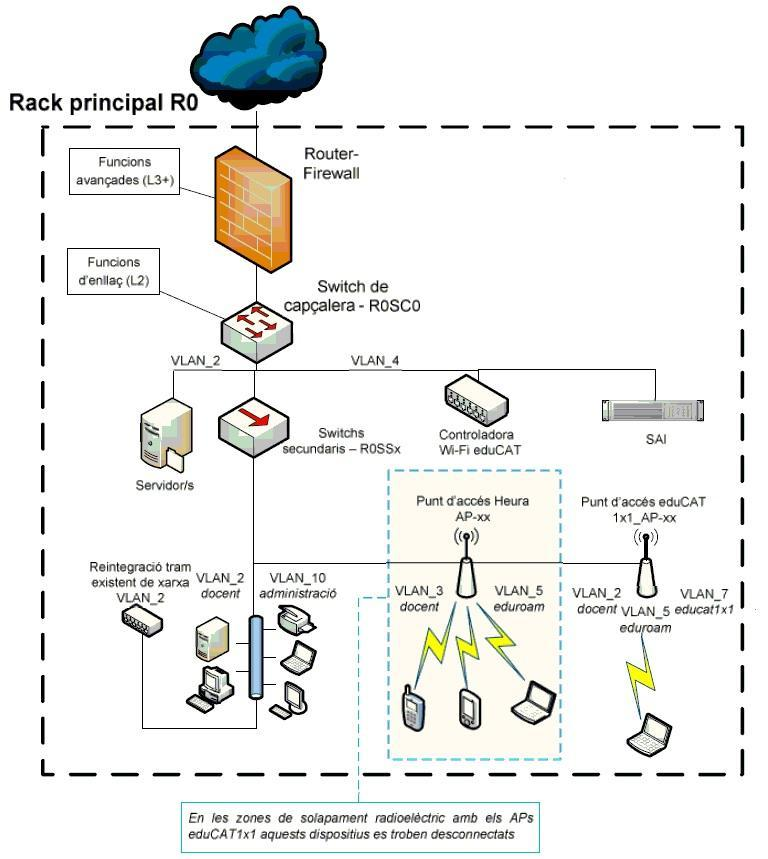

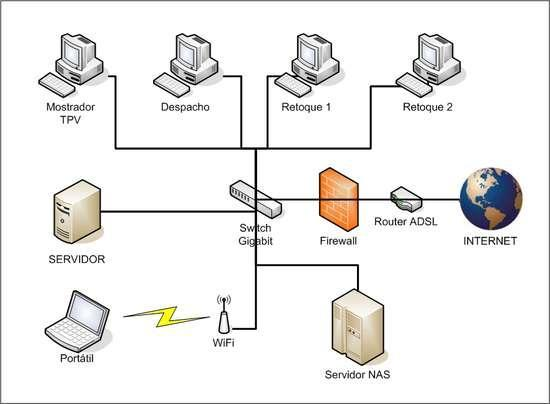

### Topologies de xarxes locals: físiques i lògiques

La topologia defineix l'estructura de la xarxa:

- **Topologia física**: com estan disposats físicament els medis de transmissió.
- **Topologia lògica**: com accedeixen els ordinadors a la xarxa.

#### Topologia física

- **Topologia en bus**: un únic segment de cable on tots els equips es connecten directament.
  - *Avantatges*: fàcil afegir nodes; requereix poc cable.
  - *Inconvenients*: si es trenca el cable principal, tota la xarxa cau; calen terminadors; difícil de diagnosticar; no recomanable per a edificis grans. **Tecnologia pràcticament obsoleta avui dia.**

  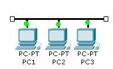

- **Topologia en anell**: cada equip es connecta amb el següent, i l'últim amb el primer. Mateixos avantatges/inconvenients que el bus, però sense necessitat de terminadors. **També en desús** en xarxes locals modernes (es manté conceptualment en alguns protocols d'anell com **Token Ring**, ja obsolet, o en anells de fibra en xarxes d'operador amb finalitat de redundància).

  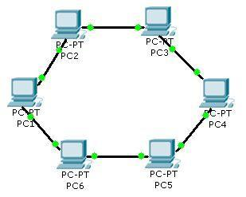

- **Topologia en estrella**: totes les línies es connecten a un punt central (switch). És la **topologia física dominant avui dia** en xarxes LAN cablejades.
  - *Avantatges*: fàcil instal·lació; es pot desconnectar un node sense afectar la resta; fàcil de diagnosticar.
  - *Inconvenients*: requereix més cable que el bus; si falla el switch central, s'aïllen tots els nodes connectats a ell; cal comprar switchs.

  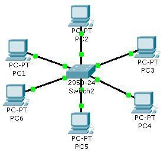

- **Topologia en estrella estesa**: diverses xarxes en estrella es connecten entre si (switchs interconnectats), formant una xarxa més gran. És l'esquema típic de moltes xarxes d'empresa i de campus actuals.

  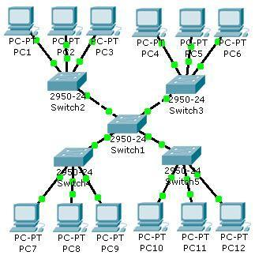

- **Topologia jeràrquica**: diverses xarxes en estrella es connecten a través d'un equip/switch central que actua com a "arrel", en forma d'arbre. Molt utilitzada en el disseny de xarxes corporatives (nucli - distribució - accés).

  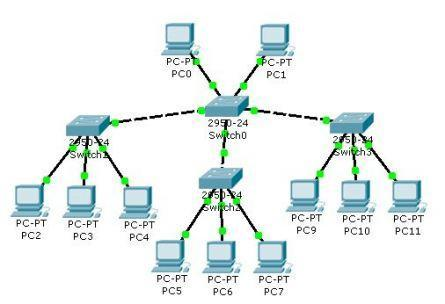

- **Topologia en malla**: tots els nodes es connecten entre si. Molt redundant i tolerant a fallades, però costosa en cablejat. Actualment es reprodueix, de manera pràctica i eficient, en els **sistemes Wi-Fi mesh**, molt populars per donar cobertura sense fils a la llar sense necessitat de cablejar cada punt d'accés.

  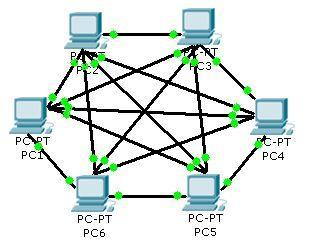

- **Topologia mixta / híbrida**: combinació de diverses topologies.

  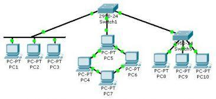

> Les xarxes sense fils no tenen un medi físic visible, però l'aire (per on viatgen les ones) es considera el medi de transmissió; conceptualment es consideren de **topologia en estrella**, ja que qualsevol dispositiu connectat pot rebre la informació que hi circula.

#### Topologia lògica

Defineix el mètode que utilitzen els hosts per comunicar-se:

- **Topologia broadcast**: cada host envia les seves dades a tots els altres; no hi ha ordre d'accés (el primer que arriba, transmet). És el fonament d'**Ethernet**.
- **Topologia de token**: l'accés al medi es controla mitjançant un testimoni digital (*token*) que va passant seqüencialment d'un host a un altre. **Tecnologia pràcticament en desús** actualment (era la base de Token Ring), substituïda a la pràctica per Ethernet commutat.

---

## 6. Estructures alternatives

Quan una xarxa combina diverses topologies, es parla de **xarxa mixta** o **topologia híbrida**. És l'esquema més habitual en xarxes reals d'una certa mida (per exemple, estrella estesa combinada amb un nucli en malla parcial per redundància).

---

## 7. Normativa legal i tècnica d'implantació de xarxes locals

### Estàndards de xarxa

Un **estàndard** és un model o patró perquè diferents fabricants el segueixin i produeixin components compatibles entre si. Poden procedir d'una iniciativa d'empreses o d'un organisme oficial.

### Organismes reguladors en matèria de xarxes

**Àmbit internacional**

- **ITU** (Unió Internacional de Telecomunicacions): organisme de l'ONU especialitzat en telecomunicacions; el seu sector d'estandardització és l'**ITU-T**.
- **ISO** (Organització Internacional per l'Estandardització) i **IEC** (Comissió Electrotècnica Internacional): desenvolupen estàndards internacionals conjuntament.
- **IEEE** (Institut d'Enginyers Elèctrics i Electrònics): elabora estàndards en el camp elèctric, electrònic i de telecomunicacions — n'és un exemple destacat la família **IEEE 802** (802.3 Ethernet, 802.11 Wi-Fi, etc.).

**Estats Units**

- **ANSI** (Institut Americà de Normes Nacionals).
- **TIA** (Associació de la Indústria de les Telecomunicacions), que treballa en col·laboració amb ANSI.

**Europa**

- **CEN**, **CENELEC** i **ETSI** formen el sistema europeu de normalització tècnica, reconegut per la Unió Europea, i desenvolupen els estàndards europeus (**EN**).

**Espanya**

- Els **Comitès Tècnics de Normalització (CTN)**, juntament amb **UNE** (Asociación Española de Normalización), elaboren les **normes UNE**. UNE és membre d'ISO/IEC i de CEN/CENELEC.

> **Nota d'actualització:** anteriorment l'organisme espanyol de normalització es coneixia com **AENOR**; des de 2017, l'activitat de normalització es porta a terme sota la marca **UNE** (Asociación Española de Normalización), mentre que AENOR va quedar com a entitat independent dedicada principalment a la certificació.

---

## 8. Documentació tècnica

Davant qualsevol problema, canvi o millora, cal tenir documentat correctament el sistema amb la informació més actualitzada possible. Documents imprescindibles:

- **Mapa de xarxa**: representació gràfica de la topologia, incloent connexions internes i externes. Se sol confeccionar en dues versions: **lògica** (funcionalitat, adreces, rol de cada element) i **física** (connectivitat real del cablejat).
- **Mapa de nodes**: descripció del maquinari i programari de cada node (models, marques, adreces de xarxa, configuració), amb un històric d'avaries i actualitzacions.
- **Mapa de protocols**: organització lògica de la xarxa (màscares de subxarxa, passarel·les, configuració de routers, dominis o grups de treball).
- **Mapa de grups i usuaris**: descripció de grups i usuaris, drets d'accés a recursos i aplicacions, perfils i privilegis.
- **Mapa de recursos i serveis**: recursos disponibles, servei que ofereixen, ubicació física o lògica, i usuaris/grups amb accés.
- **Calendari d'avaries**: registre d'incidències per analitzar causes i probabilitat de fallada de components.
- **Informe de costos**: estudi econòmic de manteniment i de noves inversions.
- **Pla de contingències**: descriu què fer en cas de desastre; sol incloure temps estimats de recuperació (**RTO**) i de pèrdua de dades acceptable (**RPO**), conceptes estàndard avui en la gestió de continuïtat de negoci.

Per implantar una xarxa local cal documentar, entre d'altres:

- el maquinari de la LAN (dispositius de xarxa i medi de transmissió)
- la configuració de targetes de xarxa i routers
- la configuració dels servidors
- el programari de la LAN (sistemes operatius)
- l'ús de protocols (TCP/IP, i cada cop més sovint IPv6)
- els passos per instal·lar la xarxa
- la documentació lògica i física de la xarxa

> Qualsevol implementació o modificació d'una xarxa **s'ha de documentar**.